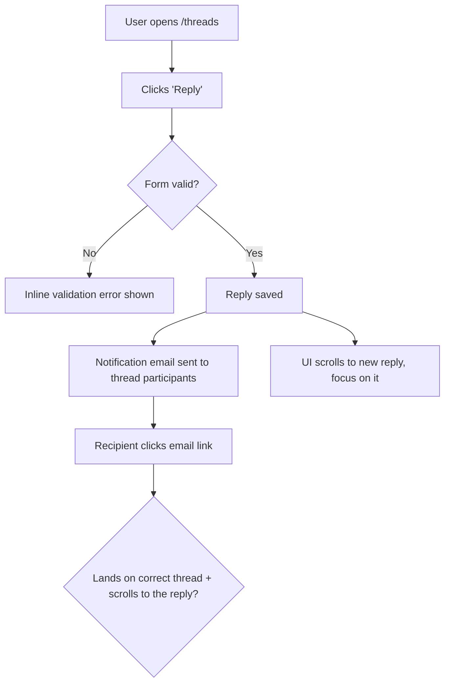

# Dogfood (Beta)

Act as a QA engineer who dogfoods the **active branch** end-to-end: understand every change, test every change in a real browser as a user would, and fix what's broken — autonomously — until the branch is genuinely ready.

This is **diff-scoped**, not whole-app exploration. You test what *this branch* introduced or modified versus `main`. (For full-app exploratory QA, use the `dogfood` skill instead.)

## Use `agent-browser` Only For Browser Automation

This workflow drives the browser exclusively through the `agent-browser` CLI. Do not use Chrome MCP tools (`mcp__claude-in-chrome__*`), any browser MCP integration, or other built-in browser-control tools. If the platform offers multiple ways to control a browser, always choose `agent-browser`. Use the direct binary, never `npx agent-browser` (the direct binary uses the fast Rust client).

## Prerequisites

- A local dev server you can start (`bin/dev`, `rails server`, `npm run dev`, etc.).
- `agent-browser` installed. Check:

  ```bash
  command -v agent-browser >/dev/null 2>&1 && echo "Ready" || echo "NOT INSTALLED"
  ```

  If not installed, run the `ce-setup` skill to install dependencies, then resume. Do not continue without it.

## Reusing Compound-Engineering Skills

`ce-dogfood-beta` is an orchestrator. Prefer delegating to existing CE skills over re-deriving their behavior:

| When | Skill | Why |
|------|-------|-----|
| Phase 0 isolation | `ce-worktree` | Run the dogfood in an isolated worktree so the main checkout stays clean. |
| agent-browser missing | `ce-setup` | Installs `agent-browser` and other deps. |
| A failure's root cause is non-obvious | `ce-debug` | Systematic root-cause analysis instead of guess-and-check. |
| Committing each fix | `ce-commit` | Consistent, well-scoped commit messages. |
| A bug reveals a reusable lesson | `ce-compound` | Capture the learning so the team compounds knowledge. |

Reuse `ce-test-browser`'s mechanics for port detection and dev-server startup (see Phase 3) rather than reinventing them.

## Workflow

```
0. Scope        Pick the branch, get onto it (offer worktree), never touch main
1. Analyze      Diff branch vs main, understand every change
2. Map+Matrix   Map user flows as Mermaid flowcharts, then derive the test matrix as a task list
3. Serve        Detect port, start dev server, open agent-browser
4. Execute      Work the matrix one item at a time with agent-browser
5. Fix loop     On failure: fix -> add regression test -> commit -> continue
6. Report       Write durable doc to docs/dogfood-reports/ (flows, matrix, fixes, learnings, verdict)
```

### Phase 0: Scope and Get on the Right Branch

Parse `$ARGUMENTS`: a PR number, a branch name, or blank (use current branch). Strip `--port PORT` if present.

1. Resolve the target branch:
   - **PR number:** `gh pr checkout <number>` (probe for an existing worktree first).
   - **Branch name:** check it out (probe for an existing worktree first).
   - **Blank:** use the current branch.
2. **Refuse to run on `main`/`master`.** If the resolved branch is the trunk, stop and tell the user — there is no diff to dogfood.
3. **Offer isolation.** Ask whether to run in a git worktree so the main checkout stays untouched (use the platform's blocking question tool). If yes, hand off to `ce-worktree`; if no, continue in place.
4. **Resume if a prior run exists.** Look for an existing report at `docs/dogfood-reports/*-<branch-slug>-dogfood.md`. If one is found with unfinished scenarios, ask whether to resume it or start fresh. To resume, re-hydrate the task list from its matrix (Pass/Fixed/Skipped stay done; Pending/Blocked/in-progress become the remaining work) and continue from there.

### Resumability (stop and return at any point)

This workflow is designed to be interrupted and resumed. Two pieces of state make that safe:

- **The task list** (`the platform's task-tracking primitive`/`the platform's task-tracking primitive`) is the live to-do — one task per matrix scenario. Mark each `in_progress` when you start it and `completed` only when it genuinely passes.
- **The report doc** at `docs/dogfood-reports/<YYYY-MM-DD>-<branch-slug>-dogfood.md` is the durable checkpoint that survives across sessions. **Create it as soon as the matrix exists (end of Phase 2)** with every scenario listed as `Pending`, and **update it incrementally** — after each scenario is judged and after each fix is committed — not only at the end.

Because tasks are session-scoped but the report doc is on disk, the report is the source of truth for resuming. Always keep the two in sync so a later run (or a teammate) can pick up exactly where this one stopped.

### Phase 1: Analyze Changes

Pull the full diff against `main` and read it carefully — you cannot test what you don't understand.

```bash
git diff --name-only main...HEAD     # what changed
git diff main...HEAD                 # how it changed
```

Build a mental model of every change: new features, modified behavior, new routes/views/components, touched data flows. Note anything that produces user-visible behavior — that is what the matrix must cover.

**Ground in the product's personas and vision.** Look for persona and vision context so flows can be judged from real users' eyes, not just "does it work." Check, in order: `STRATEGY.md` (its "Who it's for" section names the primary persona and their job-to-be-done), `VISION.md`, and any persona docs (e.g. `docs/personas/`, `PERSONAS.md`). Capture the 1-3 primary personas and what each cares about. If none exist, infer a reasonable primary persona from the product and the diff, and say so in the report.

### Phase 2: Map the Flows, Then Build the Matrix

The quality of the whole dogfood depends on this phase. Do not jump straight to a flat list of pages. First **understand the user flows the diff touches**, then derive the matrix from them. A matrix built without a flow model tests pages in isolation and misses the journey — the email that "sends" but lands in the wrong thread.

#### 2a. Map the user flows (required)

For every user-visible change, trace the **complete journey** end to end and draw it. Map each flow as a **Mermaid `flowchart`** so the journey is explicit and reviewable before any testing happens — entry point, each user action, branch points (success / validation error / empty / permission-denied), side effects (emails, jobs, notifications), and the true end state.

> Email example: it's not enough that "an email sends." Does it go to the *right* recipient? When the user clicks through, does the app land on and scroll to the *right* message? Does the content make sense? Does the whole flow align with the product's vision and UX? The flowchart must carry the click-through and its destination, not stop at "email sent."



Produce one flowchart per distinct journey. Cover the happy path **and** the branch points (error, empty, boundary, permission). These diagrams ARE the understanding — they become the spine of the matrix and belong in the final report.

#### 2b. Derive the matrix from the flows

Walk each flowchart and turn every node and branch into one or more test scenarios. Read `references/test-matrix-taxonomy.md` for the full set of dimensions (journeys, functional checks, experiential checks, edge/error/empty states, accessibility, responsiveness). Cover both **functional** ("does it work?") and **experiential** ("does it feel right and align with the product?").

Map changed files to concrete routes (views -> their pages, components -> pages rendering them, layouts -> all pages, stylesheets -> visual regression on key pages) and attach those routes to the flows that exercise them.

**Load the matrix as a task list** (`the platform's task-tracking primitive`), one task per scenario, so progress is tracked and nothing is skipped. Order tasks by flow, following the flowcharts, not by file.

### Phase 3: Detect Port and Start the Dev Server

Determine the port (priority: explicit `--port` > `AGENTS.md`/`CLAUDE.md` > `package.json` dev script > `.env*` `PORT=` > default `3000`). If a server is already listening, reuse it; otherwise start the project's dev command in the background and wait for the port to come up. This is the same mechanism `ce-test-browser` uses — follow its Phase 5–6 logic.

```bash
agent-browser open "http://localhost:${PORT}"
agent-browser snapshot -i
```

### Phase 4: Execute the Matrix

Work the task list **one item at a time**. For each scenario, mark the task `in_progress`, then:

1. **Document** what you're testing (the journey and the expected outcome).
2. **Drive it** with agent-browser — navigate, snapshot for interactive refs, click, fill, submit, follow the journey to its real end state:

   ```bash
   agent-browser open "http://localhost:${PORT}/<route>"
   agent-browser snapshot -i
   agent-browser click @e1
   agent-browser fill @e2 "value"
   agent-browser screenshot <scenario>.png
   agent-browser errors      # check console/page errors
   ```

3. **Judge** both correctness and experience: right data, right destination, sensible content, no console errors, and does it feel aligned with the product?
4. **Walk it as each persona.** Re-run the journey in your head from each primary persona's perspective (from Phase 1) and ask where they'd feel a **paper cut** — a small friction that wouldn't fail a functional test but degrades the experience: a confusing label, an extra click, an unexpected jump, a slow-feeling step, missing feedback, copy that doesn't match how that persona thinks. A scenario can be functionally `Pass` yet still carry paper cuts. Note each paper cut, which persona feels it, and its severity.
5. **Record** pass/fail plus any paper cuts, with specifics. Mark the task `completed` only when it genuinely passes (paper cuts are logged, not blockers — fix the sharp ones in Phase 5, surface the rest in the report).

**External-interaction flows** (OAuth, real email delivery, payments, SMS) can't be fully driven headlessly — pause and ask the user to verify that leg, then continue.

### Phase 5: Fix Loop (Autonomous)

When a scenario fails, **fix it and prove it** — but first decide whether the fix is yours to make autonomously or a human's to decide.

**Judge the size of the fix before touching code.** Auto-fix when the change is small, well-understood, and low-risk: a clear bug with an obvious correct fix, contained to a few files, no schema/architecture/product trade-off. **Do not auto-fix** when the change is large or ambiguous — it requires an architectural or schema decision, changes product behavior or UX intent, spans many files, has plausible competing solutions, or you're not confident the "right" answer is unambiguous. Forcing a big judgment call autonomously is worse than escalating it.

**For autonomous fixes:**

1. Investigate the root cause. If it's non-obvious, use `ce-debug`.
2. Apply the fix in the code.
3. **Add an automated regression test** that fails before the fix and passes after, so the bug can't return.
4. Commit the fix with a clear message (use `ce-commit`). One logical fix per commit.
5. Re-run the failing scenario in the browser to confirm it now passes; then continue the matrix.
6. If the bug carried a reusable lesson, capture it with `ce-compound`.

**For changes too big to make autonomously:** do not implement. Record it in the report's **Decisions for a human** section with: what's broken, why it's not a safe autonomous fix, the options you see (with trade-offs), and your recommendation. Mark the scenario `Blocked (human decision)` in the matrix, then continue with the rest. Never make a large, irreversible, or product-altering change just to clear a matrix item.

Keep iterating until every task is `completed` or explicitly `Blocked (human decision)`. Re-test anything a fix might have affected (watch for regressions in adjacent journeys).

### Phase 6: Write the Report Artifact

The report doc was created at the end of Phase 2 and updated incrementally throughout (see Resumability). When the matrix is green (or every remaining item is explicitly blocked), **finalize** it at `docs/dogfood-reports/<YYYY-MM-DD>-<branch-slug>-dogfood.md` in the repo under test, then surface a short summary in chat with the file path.

Use `references/dogfood-report-template.md` as the shape — the same way plans and brainstorms are captured from a template. The finalized artifact must include:

1. **Diff Summary** — what changed between the branch and `main`.
2. **Personas** — the primary personas evaluated against (and their source: STRATEGY.md / VISION.md / inferred).
3. **Flows tested** — the Mermaid flowcharts from Phase 2a, so the journeys are preserved.
4. **Test Matrix & Results** — every scenario: what was tested, pass/fail, issue found, fix applied, commit SHA.
5. **What was fixed** — each bug, its root cause, the fix, the regression test added, and the commit.
6. **Paper cuts (by persona)** — experiential friction found, which persona feels each, severity, and whether fixed or deferred.
7. **Decisions for a human** — issues too big to fix autonomously: what's broken, why it was escalated, options with trade-offs, and a recommendation.
8. **Learnings** — reusable lessons worth carrying forward (feed substantial ones to `ce-compound`).
9. **Final Status** — readiness verdict, plus anything still blocked or needing human verification.

Use repo-relative paths in the doc, never absolute paths, so it stays portable.
