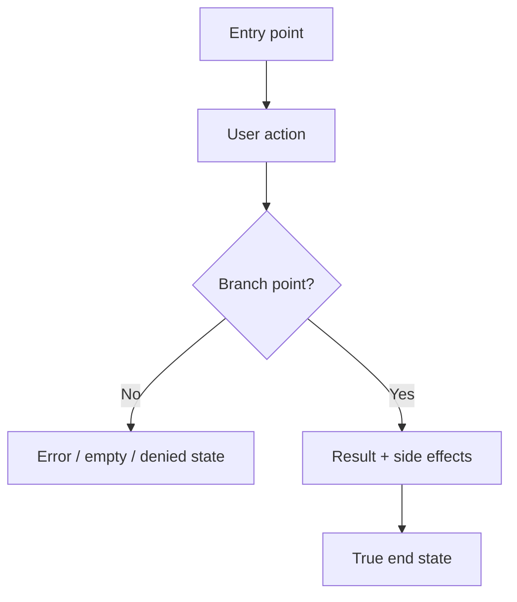

# Dogfood Report — <branch>

> Diff-scoped browser QA of `<branch>` vs `main`. Generated by `/ce-dogfood-beta` on <YYYY-MM-DD>.

## Diff Summary

<What changed between the branch and main: new features, modified behavior, new/changed routes, views, components, data flows. 2-6 bullets.>

## Personas

<The primary personas the flows were judged against, and what each cares about. Note the source: STRATEGY.md "Who it's for", VISION.md, a persona doc, or "inferred" if none existed.>

- **<Persona name>** — <job-to-be-done / what they care about>

## Flows Tested

<One Mermaid flowchart per distinct user journey the diff touches. Include happy path and branch points (validation error, empty, permission-denied), side effects (emails, jobs, notifications), and the true end state — including click-through destinations.>

## Test Matrix & Results

| # | Flow | Journey / Scenario | Status | Issue | Fix | Commit |
|---|------|--------------------|--------|-------|-----|--------|
| 1 |      |                    | Pass   | -     | -   | -      |
| 2 |      |                    | Fixed  |       |     | abc123 |
| 3 |      |                    | Blocked (needs human verify) | | | |

Status values: `Pending`, `Pass`, `Fixed`, `Skipped`, `Blocked (needs human verify)`, `Blocked (human decision)`. Start every scenario at `Pending` so this table doubles as the resume checkpoint.

## What Was Fixed

For each issue found and fixed:

### <Short issue title> — `<commit>`
- **Symptom:** <what the user saw / what failed in the browser>
- **Root cause:** <why it happened>
- **Fix:** <what changed, repo-relative file paths>
- **Regression test:** <test added that fails before / passes after>

## Console Errors

<Any console or network errors observed, and whether they were resolved. "None" if clean.>

## Human Verifications

<External-interaction legs (OAuth, real email delivery, payments, SMS): confirmed, pending, or not applicable.>

## Decisions for a Human

<Issues too big or ambiguous to fix autonomously — architectural/schema changes, product/UX trade-offs, competing solutions. One block each. The matrix marks these `Blocked (human decision)`. "None" if every issue was safely auto-fixed.>

### <Short title>
- **What's broken:** <symptom / failing scenario>
- **Why escalated:** <why it's not a safe autonomous fix — scope, risk, ambiguity, product trade-off>
- **Options:** <option A (trade-offs) / option B (trade-offs)>
- **Recommendation:** <the agent's suggested direction, for the human to confirm>

## Learnings

<Reusable lessons worth carrying forward — patterns, gotchas, product/UX insights. Feed substantial ones to `ce-compound`.>

## Final Status

<Overall readiness verdict for the branch. Ready to ship? Caveats? Outstanding blocked items?>
